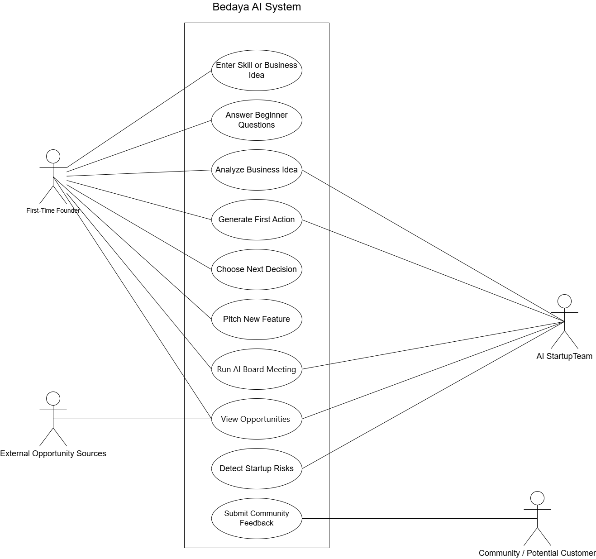
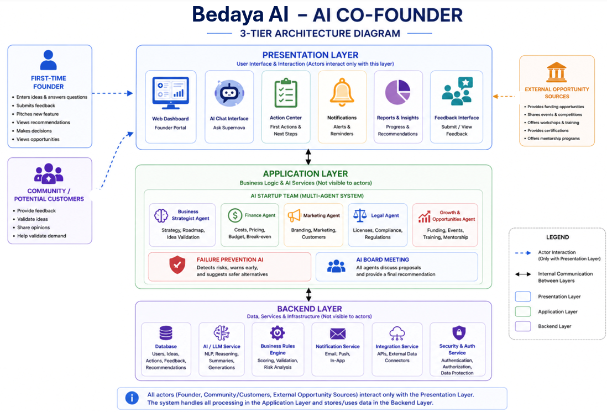
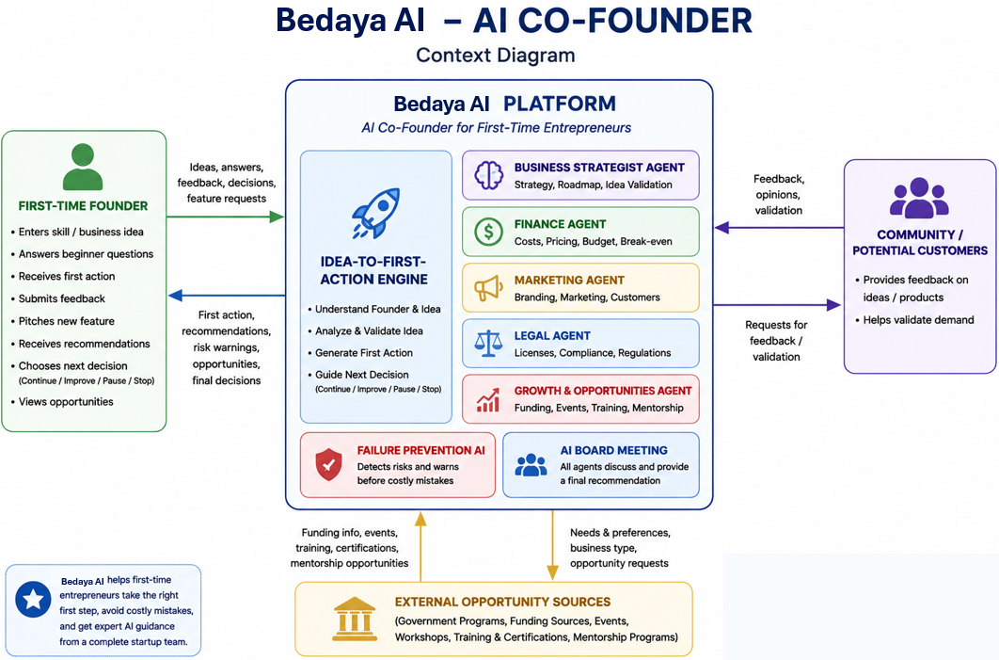
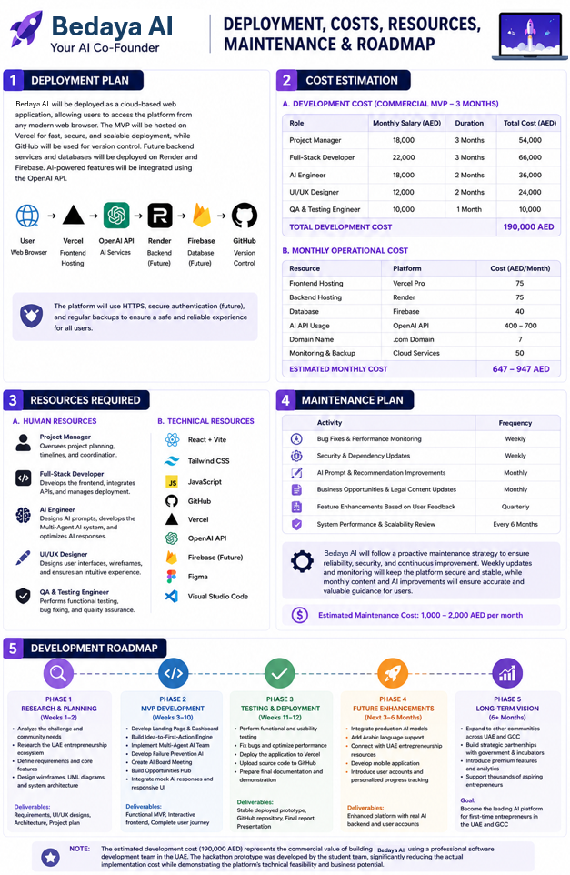

# 🌟 Bedaya AI — Your AI Co-Founder for Rural Entrepreneurs

> **Helping first-time entrepreneurs in Al Qua'a, Al Ain, UAE take the right first step.**

[](https://reactjs.org/)
[](https://vitejs.dev/)
[](https://tailwindcss.com/)
[](https://reactrouter.com/)

🔗 **Live Demo:** https://khadejaahmedkz.github.io/Supernova-Tatweer-Hackathon/
📁 **Interview Evidence & Recordings:** https://drive.google.com/drive/folders/13jnzCuaWVrx3RRsy5Vq30lVqk81LCZMD

---

## 📌 Table of Contents

- [1. The Challenge and the Problem](#1-the-challenge-and-the-problem)
- [2. Who It Is For, and Their Situation](#2-who-it-is-for-and-their-situation)
- [3. The Solution](#3-the-solution)
- [4. Impact and Testable Claims](#4-impact-and-testable-claims)
- [5. Feasibility and Deployment](#5-feasibility-and-deployment)
- [6. Scalability](#6-scalability)
- [7. Evidence and Validation](#7-evidence-and-validation)
- [8. How to Run or Verify It, and Tools Used](#8-how-to-run-or-verify-it-and-tools-used)
- [Security — Idea Vault, Al-Amanah, AI Disclaimer](#-security-design)
- [All Features](#-all-features--best-first)
- [System Diagrams](#-system-diagrams)
- [Planning & Business](#-planning--business)
- [Tech Stack](#-tech-stack)
- [Project Structure](#-project-structure)
- [Team](#-team)

---

## 1. The Challenge and the Problem

`Earns: Relevance`

**Challenge 1 — Taking the First Entrepreneurial Step**

The specific problem: people in Al Qua'a have real ideas and real skills — camel farm products, desert tourism, homemade food, rural delivery — but they never start a business. The barrier is not ambition. It is not knowing what the first move is, what is required, or where to begin.

Through interviews with active business owners in Al Ain and discussions with a resident familiar with the area, a consistent pattern emerged: people wait because they do not know whether to register first or test first, how much money to spend, what permits apply to them, or who to ask. There is no local mentor. Business resources are built for cities. The idea stays in their head and the business never happens.

This is not a motivation problem. It is an information and confidence problem — and it is solvable.

**The scale of the opportunity:**

- SMEs account for **98% of businesses in Abu Dhabi**, employ **46% of the workforce**, and contribute **42.8% of non-oil GDP**
- New economic licences in Al Ain increased by **29% in 2025**, reflecting rising entrepreneurial interest
- The MZN Hub71 Al Ain initiative received **370+ applications**, with **75%+ being first-time entrepreneurs**
- Al Ain is home to **nearly half of Abu Dhabi's agricultural activity**, creating unique rural business opportunities
- The UAE aims to become the **world's entrepreneurial nation by 2031** through the National Entrepreneurship Agenda

The infrastructure and ambition exist. What is missing is the first step — and that is exactly what Bedaya AI provides.

---

## 2. Who It Is For, and Their Situation

`Earns: Impact`

**The exact group:** First-time founders in Al Qua'a, Al Ain — a rural community in Abu Dhabi's Eastern Region. A large share of families run camel farms. The area sits near the Tropic of Cancer and is known for stargazing, agricultural heritage, and strong community ties.

**Their situation in real terms:**

- No business mentor or expert in the community to consult
- Business registration information is spread across multiple government websites in formal Arabic and English — inaccessible to someone who has never started a business
- The most common early mistake — spending on branding, registration, or equipment before testing demand — can wipe out an entire household starting budget of AED 300–700
- Rural UAE founders are underserved by existing platforms: most startup tools assume city access, digital fluency, and English literacy

**What this costs them today:** An untested idea that fails after AED 500 in premature spending can set a family back months. More commonly, the idea is simply never tried. The cost is invisible — it is the business that never started.

**Confirmed by our community interviews:** All three business owners we interviewed said their biggest challenge was not ambition — it was lacking knowledge, experience, or support to take the first step. This is the exact gap Bedaya AI closes.

---

## 3. The Solution

`Earns: Relevance, Readiness`

**Bedaya AI** is an AI co-founder platform that takes a first-time founder from *"I have an idea"* to *"I know my exact first action"* — without business jargon, without a business plan, and without spending money first.

A founder describes their idea in plain language or by speaking in Arabic or English. Bedaya AI analyses it against local context — Al Qua'a pricing, rural UAE demand signals, community fit — and returns one specific, low-risk first action they can take today. Behind that is a full AI advisory team covering strategy, finance, marketing, legal, and growth — each answering in plain language with UAE-specific guidance.

**The core flow — under 5 minutes end to end:**

| Step | What happens |
|------|-------------|
| 1 | Founder describes their idea and situation (3-step onboarding) |
| 2 | AI analyses the idea — Readiness, Community Fit, Risk, Confidence scores |
| 3 | One specific, safe first action is generated — not a business plan |
| 4 | Founder consults 5 AI agents, runs failure prevention, or calls a board meeting |
| 5 | Curated UAE opportunities surfaced based on the idea |

**How Bedaya addresses every need identified in our community interviews:**

| Survey Finding | Bedaya Feature |
|---------------|---------------|
| "I didn't know where to start." | Idea-to-First-Action Engine generates one practical first task |
| Lack of business experience | AI guides users through each step with simple explanations |
| Need to understand customers | Idea Validation recommends who to speak to and how to collect feedback |
| Fear of financial loss | Failure Prevention AI encourages testing before large investments |
| Need for local relevance | Regional Intelligence adapts recommendations for Al Qua'a — camel farming, agriculture, rural services, stargazing tourism |
| Need for continued support | AI Team (Strategy, Finance, Marketing, Legal, Growth) unlocks after idea validation |

A non-technical judge can open the live demo, enter a business idea, and see the full output in under two minutes.

---

## 4. Impact and Testable Claims

`Earns: Impact, Evidence`

**Claim 1 — Time to first action**
Bedaya AI reduces the time for a first-time founder to reach a clear, actionable first step to under 5 minutes.
*How to verify: Run the demo. Complete the 3-step onboarding with any idea. The output is a single specific action with step-by-step instructions. Time the process yourself.*

**Claim 2 — Government resource consolidation**
The platform surfaces UAE-specific legal and funding guidance that would otherwise require navigating at least 4 separate government websites: ADDED, ADAFSA, Khalifa Fund, and Tamm.
*How to verify: Open `/opportunities`. Compare the 8 consolidated programmes directly against their source sites.*

**Claim 3 — Failure prevention accuracy**
The Failure Prevention AI correctly identifies and categorises the most common early-stage founder mistakes documented in UAE SME research.
*How to verify: Enter "I want to spend AED 5,000 on branding before I have any customers." The system returns High Risk, names the specific mistake, and offers a safer alternative. The full logic is readable in `src/data/mockData.js`.*

**Claim 4 — Multi-perspective decision support**
The Board Meeting exposes a founder's decision to five independent AI perspectives before they act — each from a distinct professional lens.
*How to verify: Pitch any decision at `/board-meeting`. Each of the 5 agents votes independently. The final verdict is a majority outcome with full reasoning.*

**Claim 5 — Validated by real business owners in Al Ain**
We interviewed 3 active business owners using a bilingual Arabic/English survey. Every core problem Bedaya AI solves was independently confirmed before the owners saw the product.

| What they told us | What Bedaya does about it |
|------------------|--------------------------|
| "I didn't know where to start" (all 3) | One clear first action, generated in under 5 minutes |
| Fear of wasting money (Eduard, Mahmoud) | Failure Prevention AI before any spending decision |
| No local guidance available (Tariq) | Al Qua'a-specific opportunities and context throughout |
| "AI would have saved me money, marketing, and time" (Mahmoud) | Full AI advisory team across 5 business domains |
| Local advice more useful than generic (Eduard, Tariq) | Every recommendation tuned to Al Qua'a context |

🎥 **Interview recordings + survey forms:**
**https://drive.google.com/drive/folders/13jnzCuaWVrx3RRsy5Vq30lVqk81LCZMD**

---

## 5. Feasibility and Deployment

`Earns: Feasibility`

**Current state:** Fully functional frontend prototype, deployed on GitHub Pages. All AI responses are mock data — honest and intentional for hackathon scope. Account system, idea sealing, and data minimization receipts are real, working code that judges can verify.

**Deployment architecture:**

```
User → Vercel (Frontend) → OpenAI API (AI Services) → Render (Backend/Future) → Firebase (Database/Future) → GitHub (Version Control)
```

The MVP will be hosted on Vercel for fast, secure, and scalable deployment. Future backend services will be deployed on Render and Firebase. AI-powered features will be integrated using the OpenAI API.

**Monthly running cost (production):**

| Resource | Platform | AED/Month |
|----------|----------|-----------|
| Frontend Hosting | Vercel Pro | 75 |
| Backend Hosting | Render | 75 |
| Database | Firebase | 40 |
| AI API Usage | OpenAI API | 400–700 |
| Domain Name | .com | 7 |
| Monitoring & Backup | Cloud Services | 50 |
| **Total** | | **647–947 AED** |

At AED 650–950/month, this platform is financially viable as a free community service funded by a single small grant. The Khalifa Fund — which the platform already surfaces to users — actively funds platforms of this type.

**Who runs it:** A single developer on a maintenance contract can maintain and update the platform. Monthly content updates require no technical expertise — the data file is structured to be edited without code changes.

**Real obstacles, stated honestly:**

- Arabic language support in AI responses requires a bilingual model or translation layer — not yet implemented beyond voice input
- Community adoption in a rural area requires an onboarding campaign, ideally with a local partner such as the Al Ain Chamber of Commerce
- AI response accuracy for UAE-specific legal guidance must be reviewed by a licensed professional before real deployment

**Maintenance plan:**

| Activity | Frequency |
|----------|-----------|
| Bug Fixes & Performance Monitoring | Weekly |
| Security & Dependency Updates | Weekly |
| AI Prompt & Recommendation Improvements | Monthly |
| Business Opportunities & Legal Content Updates | Monthly |
| Feature Enhancements Based on User Feedback | Quarterly |
| System Performance & Scalability Review | Every 6 Months |

**Estimated maintenance cost: AED 1,000–2,000/month**

---

## 6. Scalability

`Earns: Scalability`

**Within Al Qua'a:** No physical infrastructure required. Any founder with a smartphone and mobile data can use it. Adding users costs nothing beyond incremental API usage.

**Across the UAE:** The local data layer (`src/data/mockData.js`) is the only region-specific component. A version for Al Ain, Ras Al Khaimah, or Fujairah can be deployed in days by updating the data file and opportunity listings. No architectural change required.

**Across the GCC:** The same structure works for any Arabic-speaking rural community. The core problem — first-time founders with no mentor and no clear first step — exists across rural Saudi Arabia, Oman, Jordan, and beyond.

**What scales automatically:** Vercel frontend, OpenAI API per-token billing, no database bottleneck at current architecture level.

**What requires investment to scale:** Bilingual AI response generation, community-specific prompt engineering, regional opportunity maintenance.

**Development roadmap:**

| Phase | Timeline | Key Deliverables |
|-------|----------|-----------------|
| Phase 1 — Research & Planning | Weeks 1–2 | Requirements, UI/UX designs, Architecture, Project plan |
| Phase 2 — MVP Development | Weeks 3–10 | Functional MVP, Interactive frontend, Complete user journey |
| Phase 3 — Testing & Deployment | Weeks 11–12 | Stable deployed prototype, GitHub repository, Final report |
| Phase 4 — Future Enhancements | Next 3–6 Months | Real AI backend, Arabic language support, Mobile app, User accounts |
| Phase 5 — Long-Term Vision | 6+ Months | UAE & GCC expansion, Government partnerships, Scale to thousands of founders |

**Long-term path:** Partnership with UAE government initiatives (Khalifa Fund, ADCCI, Tamm) to position Bedaya AI as an official first-touchpoint for rural founders across the country.

---

## 7. Evidence and Validation

`Earns: Evidence`

### Community Interviews — 3 Business Owners in Al Ain

We conducted bilingual (Arabic/English) validation interviews with 3 active business owners in Al Ain before building Bedaya AI. Their answers directly shaped every core feature.

**Participants:**
- Eduard — Ray Café
- Tariq — Prego Café
- Mahmoud — Top 10 Sweets

📁 **Full interview recordings + survey responses:**
**https://drive.google.com/drive/folders/13jnzCuaWVrx3RRsy5Vq30lVqk81LCZMD**

---

**Key Finding 1 — Entrepreneurs need guidance more than motivation**

All three business owners said starting was difficult because they lacked knowledge, experience, or support — not ambition.

- Lack of business experience
- No services or guidance available for starting
- Difficulty understanding changing customer needs and market trends

**Key Finding 2 — Understanding customers is critical**

Two participants said knowing who your customers are is one of the biggest challenges:

- Knowing who to target before opening
- Understanding customer preferences
- Adapting when market trends change

**Key Finding 3 — Local guidance is more valuable than generic advice**

All three preferred advice tailored to Al Qua'a over generic startup guidance:

- Recommendations specific to Al Qua'a
- Selling strategies differ depending on the local community
- A solution designed specifically for Al Qua'a residents would be more useful

**Key Finding 4 — AI can reduce costly mistakes**

Participants believed an AI assistant could help them:

- Save money
- Save time
- Avoid beginner mistakes
- Make better business decisions early

---

**Individual responses:**

| Participant | Biggest challenge | Would have used Bedaya? |
|-------------|------------------|------------------------|
| Eduard — Ray Café | Didn't know where to start; lack of experience | Yes, if specifically made for Al Qua'a residents |
| Tariq — Prego Café | No services available to start (خدمات مو متوفرة لبدء الشغل) | Yes — "start specifically in Al Qua'a then expand" |
| Mahmoud — Top 10 Sweets | Understanding customers and adapting when trends change | "Would have saved me money, marketing, and time" |

---

**Requirements identified from interviews:**

| Community Need | Requirement |
|---------------|-------------|
| Entrepreneurs don't know where to begin | One clear first action instead of a full business plan |
| Lack of business experience | Step-by-step guidance in simple language |
| Difficulty identifying customers | Help entrepreneurs identify and validate their first target customers |
| Fear of wasting money | Low-cost validation before major investments |
| Limited local guidance | Recommendations tailored to Al Qua'a and rural communities |
| Need for trustworthy advice | Explain why each recommendation is made, not just what to do |

---

### Market & Statistical Evidence

- SMEs account for **98% of businesses in Abu Dhabi**, employ **46% of the workforce**, and contribute **42.8% of non-oil GDP**
- New economic licences in Al Ain increased by **29% in 2025**
- MZN Hub71 Al Ain received **370+ applications**, **75%+ first-time entrepreneurs**
- Al Ain accounts for **nearly half of Abu Dhabi's agricultural activity**
- UAE National Entrepreneurship Agenda targets **top 3 in Global Entrepreneurship Index by 2031**

These statistics confirm the scale of the opportunity. Our interviews confirm the gap that Bedaya AI fills: ambition exists, infrastructure is growing, but the first step remains the hardest part.

---

### Failure Prevention Logic — Documented Patterns

| Risk Pattern | Basis |
|-------------|-------|
| Spending on branding before demand validation | Lean startup methodology; UAE SME failure data |
| Registering before testing | ADDED registration costs AED 1,000–3,000 — genuine financial risk before validation |
| Hiring before revenue | Fixed cost trap documented across SME research globally |

---

### Repository Transparency

All AI logic is readable in `src/data/mockData.js`. All security logic is in `src/security/ideaVault.js` and `src/security/alAmanah.js`. Authentication logic is in `src/auth/AuthContext.jsx`. No hidden dependencies, no obfuscated logic. A judge can verify every claim without contacting the team.

---

## 8. How to Run or Verify It, and Tools Used

`Earns: Documentation, Readiness`

🔗 **Live Demo:** https://khadejaahmedkz.github.io/Supernova-Tatweer-Hackathon/
📁 **Evidence (interviews/surveys):** https://drive.google.com/drive/folders/13jnzCuaWVrx3RRsy5Vq30lVqk81LCZMD

### Run locally

**Prerequisites:** Node.js v18 or higher

```bash
# 1. Clone the repository
git clone https://github.com/KhadejaAhmedKZ/Supernova-Tatweer-Hackathon.git

# 2. Navigate into the project
cd Supernova-Tatweer-Hackathon

# 3. Install dependencies
npm install

# 4. Start the development server
npm run dev
```

Open **http://localhost:5173** in your browser.

```bash
# Build for production
npm run build
npm run preview
```

### Full demo walkthrough

| Step | Route | Action | What you see |
|------|-------|--------|-------------|
| 1 | `/` | Open the app | Animated desert sky, walking camels, shooting stars |
| 2 | `/signup` | Click Sign In → Create one | Account form (SHA-256 hashed) |
| 3 | `/welcome` | Click Start My Journey | Welcome screen with 3 step preview |
| 4 | `/start` | Role: Housewife · Stage: Just an idea | Step 1 of 3 |
| 5 | `/start` | Idea: *"I make homemade camel milk chocolate in Al Qua'a"* | Voice mic available |
| 6 | `/start` | Budget: AED 500 · Hours: 10/week · No customers yet | Step 3 of 3 |
| 7 | `/analysis` | Submit | 6-step AI analysis animation |
| 8 | `/results` | Review output | Scores · Mission · Why AI Chose This · Success Probability · 🔐 Founder's Seal |
| 9 | `/market-discovery` | Click Explore My Market | Market Discovery with local Al Qua'a businesses |
| 10 | `/results` | Click Continue | Dashboard unlocks |
| 11 | `/dashboard` | Review | Business Health grid · Founder Journey stages |
| 12 | `/agents/finance` | Ask: *"What should I price my chocolate at?"* | 🤝 Al-Amanah Receipt · AED pricing · 🟡 AI Disclaimer |
| 13 | `/failure-prevention` | Enter: *"I want to spend AED 5,000 on branding"* | High Risk classification |
| 14 | `/board-meeting` | Pitch: *"I want to expand to Abu Dhabi"* | 5 agents debate · Chairman verdict |
| 15 | `/opportunities` | Browse | Khalifa Fund · ADAFSA · Al Ain SME Expo |

### Verify the security features

**🔐 Idea Vault — Founder's Seal:**
1. Complete onboarding with any idea
2. Open `/results` — scroll to the gold Founder's Seal card near the bottom
3. SHA-256 hash + UAE timestamp visible — generated by the browser's Web Crypto API
4. Screenshot acts as cryptographic proof of idea ownership at that moment

**🤝 Al-Amanah — الأمانة (Data Minimization Receipt):**
1. Open any Agent page e.g. `/agents/finance`
2. The Al-Amanah Receipt shows exactly which fields are shared (✓ green chips) and which are withheld (✗ struck-through grey chips)
3. The reason for the data minimization is shown in plain language
4. Definition is editable in `src/security/alAmanah.js`

**⚠️ AI Disclaimer — Hallucination Prevention:**
1. Ask any agent a question
2. Below the response: confidence badge (🟢 high or 🟡 verify before acting)
3. Reminder to verify legal and financial decisions with official UAE sources

**🔐 Authentication (SHA-256):**
1. Open DevTools → Application → Local Storage
2. Find `bedaya_users` — password is a SHA-256 hash, never plaintext
3. `bedaya_current_user` stores name + email only

### All routes

| Route | Page |
|-------|------|
| `/` | Landing Page |
| `/welcome` | Welcome Screen |
| `/login` | Sign In |
| `/signup` | Create Account |
| `/start` | Multi-Step Onboarding (3 steps) |
| `/analysis` | AI Analysis Loading |
| `/results` | Business Analysis Results + Founder's Seal |
| `/dashboard` | Business Dashboard |
| `/agents` | AI Team Selection |
| `/agents/:id` | Individual Agent Chat + Al-Amanah + AI Disclaimer |
| `/market-discovery` | Market Discovery AI |
| `/failure-prevention` | Failure Prevention AI |
| `/board-meeting` | AI Board Meeting |
| `/opportunities` | Opportunities Hub |

### Tools used

| Tool | Version | Purpose |
|------|---------|---------|
| React | 18 | UI framework |
| Vite | 4 | Build tool and dev server |
| Tailwind CSS | 3 | Utility-first styling |
| React Router DOM | 6 | Client-side routing |
| lucide-react | 0.263 | Icon library |
| Web Speech API | Browser-native | Voice input in Arabic and English |
| Web Crypto API | Browser-native | SHA-256 hashing for Founder's Seal + auth |
| JavaScript | ES2022 | Language |

**No backend. No database. No paid APIs.**
All AI responses are mock data in `src/data/mockData.js`. Security logic is in `src/security/`. Auth logic is in `src/auth/`.

---

## 🔒 Security Design

Bedaya AI asks founders to share their business ideas, budgets, and personal goals. That is sensitive information. We built three security features named after concepts from the culture this platform serves.

---

### 🔐 Founder's Seal — Idea Vault

> *"The fear that someone will steal my idea" was the #1 unspoken concern in our interviews. We addressed it with real cryptography.*

When the founder reaches the Results page, Bedaya AI:

1. Hashes their idea text + ISO timestamp using **SHA-256** via the browser's Web Crypto API
2. Displays the hash in a screenshot-able receipt
3. The hash + timestamp prove the idea existed at that exact moment

A founder can screenshot the seal and use it as evidence of prior conception if a dispute ever arises. No third-party service, no blockchain, no fees — just real cryptography that exists in every modern browser.

**Implementation:** `src/security/ideaVault.js`

---

### 🤝 Al-Amanah — الأمانة (The Sacred Trust)

> *In Emirati culture, amanah means something entrusted to you must be protected and returned honestly. A founder's business idea is an amanah. We show them exactly how we honour it.*

Al-Amanah enforces data minimization across all five AI agents and makes it visible to the founder in real time. Each agent has a defined permission set — the exact fields it may receive and the fields that are withheld:

| Agent | Permitted | Withheld |
|-------|-----------|---------|
| Strategy | idea, idea type, location, experience | name, age, budget, occupation |
| Finance | budget, idea type, location | name, age, occupation, customers |
| Marketing | idea, location, customers, idea type | name, age, budget, occupation |
| Legal | idea type, location | name, age, budget, occupation, customers |
| Growth | idea, location, budget, experience | name, age, occupation |

The **Al-Amanah Receipt** is displayed at the top of every agent detail page — not buried in a privacy policy, visible in the UI:

- ✓ Green chips for permitted fields
- ✗ Struck-through grey chips for withheld fields
- Plain-language reason for the data minimization

**Implementation:** `src/security/alAmanah.js` + `src/components/AmanahReceipt.jsx`

---

### ⚠️ AI Disclaimer — Hallucination Prevention

Every AI response includes a confidence badge and a reminder to verify legal and financial advice with official UAE sources. The confidence level is per-agent and reflects the actual reliability of AI on that topic:

| Agent | Confidence | Why |
|-------|-----------|-----|
| Strategy | 🟢 High | General principles broadly reliable |
| Marketing | 🟢 High | Suggestions to test, not commit to |
| Finance | 🟡 Verify | Estimates only — verify local costs |
| Legal | 🟡 Verify | Educational only — verify with UAE authorities |
| Growth | 🟡 Verify | Programmes change — verify with Khalifa Fund |

**Implementation:** `src/components/AIDisclaimer.jsx`

---

### 🔐 Authentication

- Passwords hashed with **SHA-256** via Web Crypto API before storage
- Accounts stored only in browser localStorage — no server, no third-party
- Show/hide password toggle, validation, error states
- After login, smart redirect: Dashboard if user has saved progress, Welcome if starting fresh

**Implementation:** `src/auth/AuthContext.jsx`

---

### Planned for production (As-Sarab Mirage + Differential Privacy)

For the production build, we have designed a fourth security layer called **As-Sarab** (السراب — *the desert mirage*) — a behavioural honeypot that silently redirects attackers to a decoy environment instead of blocking them. The architecture, threat signal list, and mirage data structure are fully documented and ready to implement when the backend lands. For the hackathon MVP we focused on shipping what we could prove works.

---

## 🌟 All Features — Best First

---

### 🥇 1. 🎤 Voice-First AI *(Most Accessible)*

**The barrier removed:** Many users in Al Qua'a are more comfortable speaking Arabic than typing. Older adults and people with limited digital literacy find text forms difficult.

- Toggle between 🇦🇪 **Arabic** and 🇬🇧 **English** with one tap
- Tap the mic → speak naturally → live transcript appears in real time
- On completion, text is automatically inserted into the form field
- Visual feedback: pulse animation, bouncing dots, live transcript box
- Arabic transcript displays right-to-left

**Example:** *"عندي فكرة أبيع حليب الإبل"* → Bedaya AI starts analysis immediately.

**Where it appears:** Onboarding (idea field, customers, concern, name) · Failure Prevention · Board Meeting · Market Discovery · Agent Detail

**Tech:** Browser-native Web Speech API — zero backend, zero API key.

---

### 🥇 2. 🗺️ Market Discovery AI *(Most Unique)*

**The barrier removed:** People don't know if anyone else is already doing their idea, or what market gaps exist in their area.

- Search by idea, category (9 types), location, radius (5/10/25 km)
- 5-step animated analysis loading sequence
- **Market Overview** — business count, avg rating, competition level badge
- **Opportunity Scores** — Demand / Competition / Innovation / Location / Overall
- **Nearby Businesses** — expandable cards with real Al Qua'a examples
- **Competitive Gap Analysis** — 3 identified market gaps
- **Untapped Opportunities** — Al Qua'a-specific insights
- **How to Stand Out** — 6 differentiator suggestions
- **AI Recommendation** — YES / MODIFY / CONSIDER DIFFERENT NICHE

**Al Qua'a mock businesses:** 🐪 Al Dhafra Camel Farm · 🌙 Desert Stars Stargazing · ☕ Oasis Coffee Truck · 🏺 Bedouin Handmade Gallery · 🌿 Al Qua'a Organic Farm · 📸 Desert Photography Studio

**Route:** `/market-discovery`

---

### 🥇 3. 🏛️ AI Board Meeting with Chairman AI *(Most Creative)*

**The barrier removed:** First-time founders make big decisions alone with no expert input.

- Founder pitches any business decision or feature
- **All 5 AI agents debate one by one** — animated sequential reveal
- Each agent answers a specific question (strategic fit, cost, customer value, legal risk, growth)
- **Chairman AI deliberates** after all agents vote — animated typing indicator
- **Final verdict:** Decision · Score /100 · Risk Level · Pros · Cons · Full reasoning
- Board meeting history saved (last 10 pitches, clickable to reload)

**Route:** `/board-meeting`

---

### 🥇 4. 🎥 AI Video Explainer *(Most Educational)*

- Every important section has a **"Watch Explanation 🎥"** button
- Modal opens via `ReactDOM.createPortal` — always full screen
- 4 slides per topic, auto-plays every 3.5 seconds
- **Toggle Arabic 🇦🇪 / English 🇬🇧** — all text switches instantly, Arabic renders RTL
- Play/Pause · Dot navigation · Prev/Next · Escape key closes

**Topics covered:** Business Readiness Score · Risk Score · Community Fit · First Action · Funding · Business Registration

---

### 🥇 5. 🤖 AI Confidence Meter + Why AI Chose This *(Most Transparent)*

**AI Confidence Meter:**
- Percentage score with animated progress bar (colour-coded: green / amber / red)
- Checklist showing exactly what passed ✓ and what's missing ✗

**Why AI Chose This:**
- 4 specific reasons generated from actual user data
- *"Your budget is AED 500 — we chose a low-cost first action"*

**Route:** `/results`

---

### 🥈 6. ⚡ Today's Mission Card *(Most Motivating)*

| Field | Example |
|-------|---------|
| Mission | Prepare 5 samples and ask 10 people if they would buy it |
| Estimated Time | 45 minutes |
| Difficulty | Easy |
| Impact | High |
| Reward | 🌟 Unlock Validation Stage |

---

### 🥈 7. 📈 Success Probability *(Most Motivating)*

- Shows **Current %** and **Can reach %** side by side
- Lists specific improvement actions with individual % boosts
- *"Validate with 10 customers first → +8%"*

---

### 🥈 8. 🏥 Business Health Dashboard *(Most Visual)*

| Category | Status Logic |
|----------|-------------|
| 💡 Idea | Green if result exists |
| 🔍 Validation | Green if has customers, Yellow if maybe |
| 📣 Marketing | Yellow if team unlocked |
| 💰 Finance | Green if budget ≥ AED 200 |
| ⚖️ Legal | Grey (not yet started) |
| 📈 Growth | Yellow if decision = continue |

---

### 🥈 9. 🌱 Founder Journey *(Most Visual)*

```
🌱 Dream → 💡 Idea → 📋 Plan → 🧪 Validate → 🛒 First Sale → 📄 License → 🚀 Launch → 📈 Grow
```

Stages unlock automatically as the user progresses. Active stage glows amber. Completed stages show ✓ in a gold ring.

---

### 🥈 10. 👤 Founder Persona + Business Stage *(Most Personalised)*

**Founder Role:** 🎓 Student · 🏠 Housewife · 👴 Retired · 🌿 Farmer · 💻 Freelancer · 👔 Employee · 🔍 Unemployed

**Business Stage:** 💡 Just an idea · 🧪 Testing · 🛒 Already selling · 🤝 Has customers · 📋 Registered · 📈 Growing

Every AI response adapts based on these inputs.

---

### 🥉 11–18. Supporting Features

| # | Feature | Route | What it does |
|---|---------|-------|-------------|
| 11 | Multi-Step Onboarding | `/start` | 3 steps: About You · Idea · Resources |
| 12 | AI Analysis Loading | `/analysis` | 6-step animated sequence, memory-leak-safe |
| 13 | Full Business Analysis | `/results` | Scores · Strengths/Weaknesses · Founder's Seal · Decisions |
| 14 | 5 AI Agents with Chat | `/agents/:id` | Smart keyword routing, history per agent, Al-Amanah receipt, AI disclaimer |
| 15 | Failure Prevention AI | `/failure-prevention` | Risk classification with safer alternative |
| 16 | Opportunities Hub | `/opportunities` | 8 UAE programmes, filterable by category |
| 17 | Animated Desert World | All pages | 280 stars, shooting stars, moon, walking camels, dunes |
| 18 | Login / Signup + Session Persistence | All pages | SHA-256 hashed accounts, localStorage, stage tracking, smart guards |

---

## 📐 System Diagrams

### 1. Use Case Diagram


The founder performs actions such as submitting inputs, viewing recommendations, making decisions, and requesting services. The system exchanges information with the community and external opportunity sources.

### 2. 3-Tier Architecture Diagram


All user interactions enter through the presentation layer, forwarded to the application layer for processing, which communicates with the backend layer for data and AI services.

### 3. Context Diagram


The founder sends business ideas, responses, and progress updates. The system returns recommendations, first actions, risk alerts, and opportunity suggestions. The community provides validation feedback.

### 4. Deployment, Costs & Roadmap


---

## 📋 Planning & Business

### Development Cost (Commercial MVP — 3 Months)

| Role | Monthly (AED) | Duration | Total (AED) |
|------|--------------|----------|-------------|
| Project Manager | 18,000 | 3 months | 54,000 |
| Full-Stack Developer | 22,000 | 3 months | 66,000 |
| AI Engineer | 18,000 | 2 months | 36,000 |
| UI/UX Designer | 12,000 | 2 months | 24,000 |
| QA & Testing Engineer | 10,000 | 1 month | 10,000 |
| **Total** | | | **190,000 AED** |

> The hackathon prototype was developed by the student team, significantly reducing actual implementation cost while demonstrating the platform's technical feasibility.

### Resources Required

| Role | Responsibility |
|------|---------------|
| Project Manager | Planning, timelines, coordination |
| Full-Stack Developer | Frontend, API integration, deployment |
| AI Engineer | Prompt design, multi-agent system, AI optimisation |
| UI/UX Designer | Interfaces, wireframes, user experience |
| QA & Testing Engineer | Functional testing, bug fixing, quality assurance |

**Technical:** React + Vite · Tailwind CSS · JavaScript · GitHub · Vercel · OpenAI API · Firebase (future) · Figma · VS Code

---

## 🛠 Tech Stack

| Technology | Version | Purpose |
|------------|---------|---------|
| React | 18 | UI framework |
| Vite | 4 | Build tool and dev server |
| Tailwind CSS | 3 | Utility-first styling |
| React Router DOM | 6 | Client-side routing |
| lucide-react | 0.263 | Icon library |
| Web Speech API | Browser-native | Voice input |
| Web Crypto API | Browser-native | SHA-256 hashing |
| JavaScript | ES2022 | Language |

**No backend. No database. No paid APIs.**

---

## 📁 Project Structure

```
bedaya-ai/
├── index.html
├── package.json
├── vite.config.js
├── tailwind.config.js
├── postcss.config.js
└── src/
    ├── main.jsx
    ├── App.jsx
    ├── index.css
    ├── auth/
    │   └── AuthContext.jsx          # SHA-256 hashed accounts
    ├── security/
    │   ├── ideaVault.js             # Founder's Seal (SHA-256 + timestamp)
    │   └── alAmanah.js              # Per-agent data permissions
    ├── context/
    │   └── AppContext.jsx           # Session state + localStorage
    ├── data/
    │   └── mockData.js              # All AI responses + opportunities
    ├── components/
    │   ├── Navbar.jsx
    │   ├── Layout.jsx
    │   ├── AmanahReceipt.jsx        # 🤝 Data minimization UI
    │   ├── AIDisclaimer.jsx         # ⚠️ Hallucination warning
    │   ├── SectionHeader.jsx
    │   ├── ScoreCard.jsx
    │   ├── AgentCard.jsx
    │   ├── OpportunityCard.jsx
    │   ├── RiskAlert.jsx
    │   ├── DecisionButton.jsx
    │   ├── BoardOpinionCard.jsx
    │   ├── VoiceMic.jsx             # 🎤 Arabic/English voice input
    │   ├── VideoExplainer.jsx       # 🎥 Bilingual explainer modal
    │   ├── ProgressTimeline.jsx     # 🌱 Founder Journey
    │   ├── StarField.jsx
    │   └── WorldBackground.jsx      # Animated desert + night sky
    └── pages/
        ├── Landing.jsx
        ├── Welcome.jsx
        ├── Login.jsx
        ├── Signup.jsx
        ├── Onboarding.jsx
        ├── AnalysisLoading.jsx
        ├── Results.jsx              # Includes 🔐 Founder's Seal
        ├── Dashboard.jsx
        ├── Agents.jsx
        ├── AgentDetail.jsx          # Includes Al-Amanah + AI Disclaimer
        ├── FailurePrevention.jsx
        ├── BoardMeeting.jsx
        ├── Opportunities.jsx
        └── MarketDiscovery.jsx
```

---

## 👩‍💻 Team

Built for **Tatweer Hackathon 2026** — Challenge 1: Taking the First Entrepreneurial Step.
Community: Al Qua'a, Al Ain, UAE.

| Name | GitHub | Role |
|------|--------|------|
| Khadeja Ahmed | [@KhadejaAhmedKZ](https://github.com/KhadejaAhmedKZ) | Team Lead & Developer |
| Bitanya Hasabework Woldemariam | [@bitanyawoldemariam](https://github.com/bitanyawoldemariam) | Collaborator |
| Latefa Mohamed Almazrouei | [@Latefa-Almazroei](https://github.com/Latefa-Almazroei) | Collaborator |
| Rama Sa'ud Abdallah | [@RamaAbdallah7](https://github.com/RamaAbdallah7) | Collaborator |
| Amtul Baseer | [@AmtulBaseer](https://github.com/AmtulBaseer) | Cybersecurity — Idea Vault & Al-Amanah |

---

## 📝 License

Built as a hackathon prototype for Tatweer Hackathon 2026, Al Qua'a, Al Ain, UAE.

---

*🌟 Bedaya AI — Because every great business starts with one small step.*
